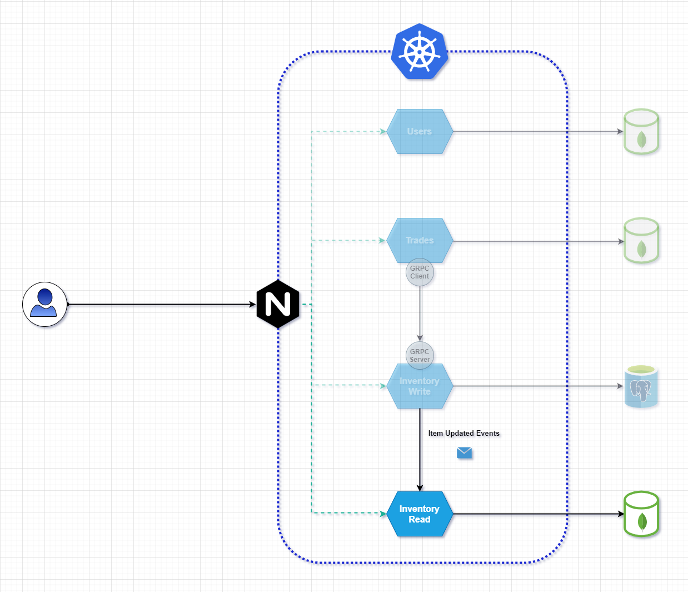

# Tradew Inventory Read

<div align="center"></div>

## Overview
The `inventory-read` microservice is a read only service, from the the `inventory` API. It's responsible for managing queries of all items

### Why separate the same API into 2 microservices?
We could expect the read side of the `inventory` api to be a lot bigger. So by separating then into 2 microservices we can scale them individually. For more informatin read [CQRS](https://en.wikipedia.org/wiki/Command%E2%80%93query_separation) and [Read/Write Ratio](https://support.liveoptics.com/hc/en-us/articles/229590547-Live-Optics-Basics-Read-Write-Ratio)

## Usage

### HTTP
To start the http server on port `9002` run the command:
```
go run main.go api
```

## Consumers
To the SQS `items-updated-consumer` run the command:
```
go run main.go items-updated-consumer
```

## Docker

You can also run using docker, go in the root of the workspace and run:
```
docker build . -t inventory-read
docker run inventory-read -p 9002:9002
```


## Architecture overview

